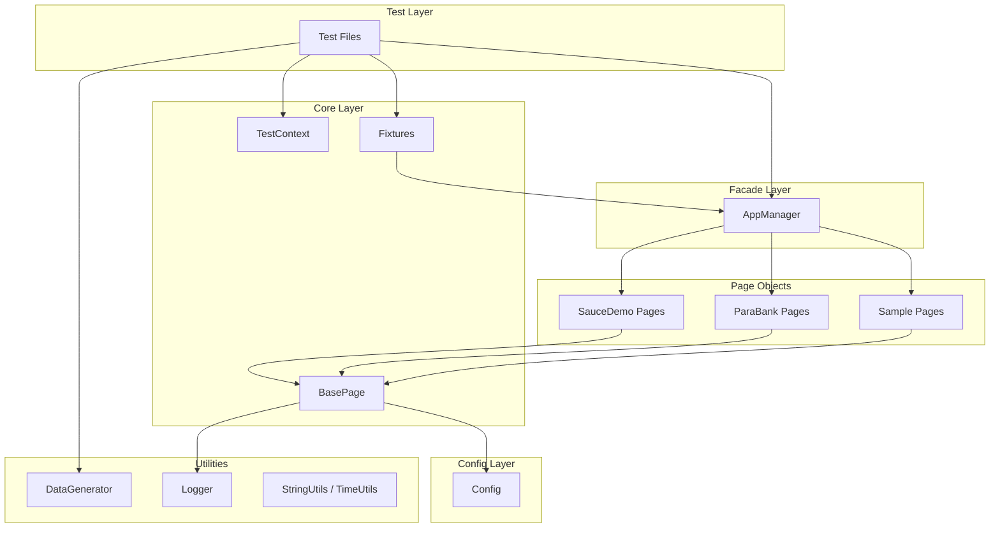

# PTF Architecture Guide

## Overview

PTF (Playwright Test Framework) is an enterprise-grade automation framework designed for scalability, type safety, and multi-team collaboration. It employs proven software design patterns to ensure maintainability across hundreds of tests.

---

## Design Patterns

### 1. Facade Pattern (AppManager)

Instead of manually initializing pages (`new LoginPage(page)`), we use a high-level `AppManager` facade.

- **Path**: `src/pages/AppManager.ts`
- **Usage**:
  ```typescript
  // Access any page through the app fixture
  await app.sauce.loginPage.login(credentials);
  await app.parabank.accountsPage.getBalance();
  ```
- **Benefit**: Decouples tests from page constructors. Adding a new page only requires updating the Manager.

### 2. Singleton Pattern (TestContext)

A centralized store to pass data between test steps without global variables.

- **Path**: `src/core/TestContext.ts`
- **Usage**:
  ```typescript
  testContext.set('userId', 123);
  const userId = testContext.get<number>('userId');
  ```
- **Benefit**: Thread-safe data sharing with typed access.

### 3. Builder Pattern (Data Factories)

Create complex test data with fluent, readable syntax.

- **Path**: `src/utils/TestDataFactory.ts`
- **Usage**:
  ```typescript
  const user = UserFactory.create().withRole('admin').withVerifiedEmail().build();
  ```

---

## Architecture Diagram



---

## Core Components

| Component       | Path                      | Purpose                                      |
| --------------- | ------------------------- | -------------------------------------------- |
| **Config**      | `src/config/index.ts`     | Unified environment configuration            |
| **BasePage**    | `src/core/BasePage.ts`    | Common page actions (click, fill, wait)      |
| **AppManager**  | `src/pages/AppManager.ts` | Facade for all page objects                  |
| **TestContext** | `src/core/TestContext.ts` | Cross-step data sharing                      |
| **Fixtures**    | `src/core/fixtures.ts`    | Playwright test extension with `app` fixture |

---

## Directory Structure

```
src/
├── api/          # API Clients & Types
├── config/       # Unified Configuration (Config class)
│   └── index.ts  # Single source of truth for all config
├── core/         # Core Logic
│   ├── BasePage.ts
│   ├── TestContext.ts
│   ├── fixtures.ts
│   └── index.ts  # Barrel export
├── pages/        # Page Objects (grouped by Application)
│   ├── AppManager.ts
│   ├── index.ts  # Barrel export
│   ├── saucedemo/
│   ├── parabank/
│   └── sample/
└── utils/        # Helpers
    ├── index.ts  # Barrel export
    ├── DataGenerator.ts
    ├── StringUtils.ts
    └── Logger.ts

tests/
├── ui/           # UI Tests
├── api/          # API Tests
├── visual/       # Visual Regression
├── accessibility/# A11y Tests
└── unit/         # Unit Tests (Vitest)
```

---

## Global Authentication

Authenticates _once_ per suite run and saves state to `storageState.json`.

- **Path**: `src/global-setup.ts`
- **Benefit**: 30-50% faster test execution by reusing session cookies.

---

## Import Conventions

Use barrel files for clean imports:

```typescript
// ✅ Preferred: Single import from barrel
import { config } from '../config';
import { BasePage, TestContext, test, expect } from '../core';
import { DataGenerator, StringUtils, Logger } from '../utils';
import { AppManager } from '../pages';

// ❌ Avoid: Deep imports
import { Config } from '../config/index';
import { BasePage } from '../core/BasePage';
```

---

## Related Docs

- [ONBOARDING.md](./ONBOARDING.md) - Step-by-step setup guide
- [TRAINING_GUIDE.md](./TRAINING_GUIDE.md) - Conceptual learning curriculum
- [BEST_PRACTICES.md](./BEST_PRACTICES.md) - Coding standards
- [FOLDER_STRUCTURE.md](./FOLDER_STRUCTURE.md) - Detailed file organization
