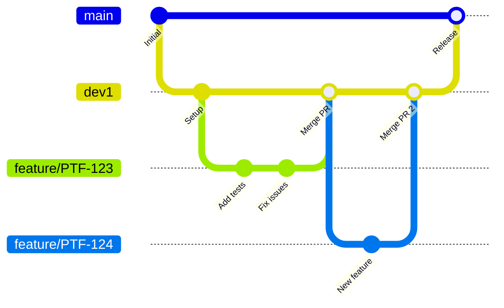

# Git Branching Strategy & Workflow

> **For Beginners**: This guide explains how we manage code changes using Git. Following these practices ensures smooth collaboration and prevents code conflicts.

---

## Table of Contents

1. [Branch Structure](#branch-structure)
2. [Branch Naming Convention](#branch-naming-convention)
3. [Complete Workflow](#complete-workflow)
4. [Commit Message Format](#commit-message-format)
5. [Code Review Checklist](#code-review-checklist)
6. [Common Git Commands](#common-git-commands)
7. [Handling Conflicts](#handling-conflicts)

---

## Branch Structure

We follow a modified **GitFlow** strategy:



### Branch Hierarchy

```
main (production-ready)
  │
  └── dev1 (integration)
        │
        ├── feature/PTF-123-add-login-tests
        ├── feature/PTF-124-api-chaining
        ├── bugfix/PTF-125-flaky-test-fix
        └── hotfix/PTF-999-critical-fix
```

| Branch      | Purpose                             | Created From | Merges To       |
| ----------- | ----------------------------------- | ------------ | --------------- |
| `main`      | Production code, always stable      | -            | -               |
| `dev1`      | Integration branch, latest features | `main`       | `main`          |
| `feature/*` | New features or tests               | `dev1`       | `dev1`          |
| `bugfix/*`  | Bug fixes                           | `dev1`       | `dev1`          |
| `hotfix/*`  | Urgent production fixes             | `main`       | `main` + `dev1` |

---

## Branch Naming Convention

### Format

```
<type>/PTF-<ticket>-<short-description>
```

### Examples

| Type       | Example                                 | When to Use             |
| ---------- | --------------------------------------- | ----------------------- |
| `feature`  | `feature/PTF-123-add-login-tests`       | New tests or features   |
| `bugfix`   | `bugfix/PTF-124-fix-flaky-dropdown`     | Non-urgent bug fixes    |
| `hotfix`   | `hotfix/PTF-125-fix-production-login`   | Urgent production fixes |
| `refactor` | `refactor/PTF-126-cleanup-page-objects` | Code improvements       |
| `docs`     | `docs/PTF-127-update-readme`            | Documentation changes   |

### Rules

- Use lowercase and hyphens
- Include ticket number if available
- Keep description short (3-5 words)
- No spaces or special characters

---

## Complete Workflow

### 1. Start New Work

```bash
# Always start from latest dev1
git checkout dev1
git pull origin dev1

# Create feature branch
git checkout -b feature/PTF-123-add-login-tests
```

### 2. Make Changes

```bash
# Check current status
git status

# Stage specific files
git add src/pages/LoginPage.ts
git add tests/ui/smoke/login.smoke.spec.ts

# Or stage all changes
git add .
```

### 3. Commit Changes

```bash
# Commit with descriptive message
git commit -m "feat(PTF-123): add login page tests

- Add LoginPage page object
- Add smoke tests for valid/invalid login
- Add test data for login scenarios"
```

### 4. Keep Branch Updated

```bash
# Regularly sync with dev1
git checkout dev1
git pull origin dev1
git checkout feature/PTF-123-add-login-tests
git merge dev1

# Or use rebase for cleaner history
git rebase dev1
```

### 5. Push to Remote

```bash
# First push (set upstream)
git push -u origin feature/PTF-123-add-login-tests

# Subsequent pushes
git push
```

### 6. Create Pull Request

1. Go to GitHub/GitLab/Azure DevOps
2. Click "Create Pull Request"
3. Select `dev1` as target branch
4. Fill in description using template
5. Request reviewers
6. Link to ticket

### 7. After Approval

```bash
# Squash merge is recommended
# (Done via UI - "Squash and merge")

# Delete local branch
git checkout dev1
git pull origin dev1
git branch -d feature/PTF-123-add-login-tests
```

---

## Commit Message Format

### Structure

```
<type>(<scope>): <subject>

[optional body]

[optional footer]
```

### Types

| Type       | Description           | Example                                     |
| ---------- | --------------------- | ------------------------------------------- |
| `feat`     | New feature or test   | `feat(PTF-123): add user profile tests`     |
| `fix`      | Bug fix               | `fix(PTF-124): resolve flaky login test`    |
| `docs`     | Documentation         | `docs(PTF-125): update onboarding guide`    |
| `test`     | Adding/updating tests | `test(PTF-126): add regression tests`       |
| `refactor` | Code restructuring    | `refactor(PTF-127): extract common methods` |
| `chore`    | Maintenance           | `chore: update dependencies`                |
| `style`    | Formatting            | `style: fix linting errors`                 |

### Examples

**Simple commit:**

```
feat(PTF-123): add login page smoke tests
```

**Detailed commit:**

```
feat(PTF-123): add login page smoke tests

- Add LoginPage page object with locators
- Add smoke tests for valid credentials
- Add smoke tests for invalid credentials
- Add test data for login scenarios

Closes #123
```

**Bug fix:**

```
fix(PTF-124): resolve dropdown selection timeout

The dropdown was timing out because it requires
a click to open before selecting. Added explicit
wait for dropdown options.

Fixes #124
```

---

## Code Review Checklist

Before requesting review, verify:

### Code Quality

- [ ] Code follows style guide (run `npm run lint`)
- [ ] No hardcoded values (use config/test data)
- [ ] Page objects used (no selectors in tests)
- [ ] Proper error handling
- [ ] No console.log statements (use logger)

### Tests

- [ ] All tests pass locally (`npm test`)
- [ ] Type check passes (`npm run type-check`)
- [ ] Tests are independent (no order dependency)
- [ ] Appropriate tags added (`@smoke`, `@regression`, etc.)
- [ ] Descriptive test names

### Documentation

- [ ] JSDoc comments on public methods
- [ ] README updated if needed
- [ ] Knowledge base updated for known issues

### Git

- [ ] Branch name follows convention
- [ ] Commit messages follow format
- [ ] No merge conflicts
- [ ] Rebased on latest dev1

---

## Common Git Commands

### Daily Operations

```bash
# Check current branch and status
git status
git branch

# Switch branches
git checkout dev1
git checkout -b feature/new-branch

# View recent commits
git log --oneline -10

# View changes
git diff
git diff --staged
```

### Syncing

```bash
# Fetch latest from remote
git fetch origin

# Pull latest (fetch + merge)
git pull origin dev1

# Push changes
git push origin feature/my-branch
```

### Undoing Changes

```bash
# Discard unstaged changes in file
git checkout -- src/pages/MyPage.ts

# Unstage file (keep changes)
git reset HEAD src/pages/MyPage.ts

# Undo last commit (keep changes)
git reset --soft HEAD~1

# Undo last commit (discard changes) ⚠️
git reset --hard HEAD~1
```

### Stashing

```bash
# Save work temporarily
git stash

# List stashes
git stash list

# Apply latest stash
git stash pop

# Apply specific stash
git stash apply stash@{2}
```

---

## Handling Conflicts

### When Conflicts Occur

```bash
# During merge/rebase, you'll see:
# CONFLICT (content): Merge conflict in src/pages/LoginPage.ts
```

### Resolution Steps

1. **Open conflicted file** - Look for conflict markers:

   ```typescript
   <<<<<<< HEAD
   // Your changes
   =======
   // Their changes
   >>>>>>> dev1
   ```

2. **Edit to resolve** - Keep desired code, remove markers:

   ```typescript
   // Resolved code
   ```

3. **Mark as resolved**:

   ```bash
   git add src/pages/LoginPage.ts
   ```

4. **Continue merge/rebase**:
   ```bash
   git merge --continue
   # or
   git rebase --continue
   ```

### Prevention Tips

- Pull from dev1 frequently
- Communicate with team about shared files
- Keep branches short-lived (1-3 days)
- Use feature toggles for large changes

---

## Quick Reference Card

```bash
# Start new feature
git checkout dev1 && git pull
git checkout -b feature/PTF-XXX-description

# Regular sync
git fetch origin
git rebase origin/dev1

# Commit and push
git add .
git commit -m "feat(PTF-XXX): description"
git push -u origin feature/PTF-XXX-description

# After merge, cleanup
git checkout dev1 && git pull
git branch -d feature/PTF-XXX-description
```

---

## See Also

- [Architecture](ARCHITECTURE.md) - Framework design
- [Folder Structure](FOLDER_STRUCTURE.md) - File organization
- [Onboarding](ONBOARDING.md) - Getting started

---

**Consistent Git practices make everyone's life easier!** 🌿
